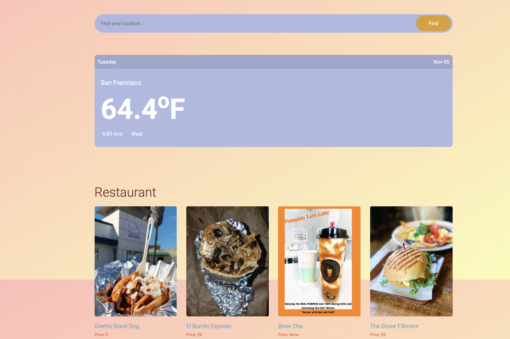

# Weat_project


# Table of Contents
- [Description](#Description)
- [Illustration](#Illustration)
- [Technology](#Technology)
- [APIs](#APIs)
- [Setup](#Setup)
- [Deployment](#Deployment)
- [Author](#Author)
- [Licensing](#Licensing)

## Description
- This project was created to build an web app that recommend restaurant based on the weather condition.
- Read this article for more information: [A journey to my first web-app using Django](https://medium.com/@673/a-journey-to-my-first-web-app-using-django-ac6154b3a5)


---
## Illustration
- Main Page

&nbsp;
- Result Page


## Technology
- Language: Python (3.7.4).
- The web-app is built on Django framework and using PostgreSQL for database.


## APIs
- [Openweatherapi](https://openweathermap.org/)
- [Yelp Fusion](https://www.yelp.com/fusion)

## Setup
- After you git clone the repository, you need to run this command to dowload all libraries in requirements.txt:
  + ```pip install -r requirements.txt```
- Next, you create a ```.env``` file to store all environment variable that you need, included:
  + DATABASE_URL
  + DJANGO_SETTINGS_MODULE
  + PASS_EMAIL
  + PASSWORD
  + SECRET_KEY
  + WEATHER_API
  + YELP_API

## Deployment
- Web-app Link:
  + [https://weat-app.herokuapp.com/](https://weat-app.herokuapp.com/)
- Landing page:
  + [Here](https://weat-app.herokuapp.com/about)

---

## Author
* **Van Phan** - [vdphan](https://github.com/vdphan)

## Licensing
This project is licensed under the MIT License - see the LICENSE file for details.
